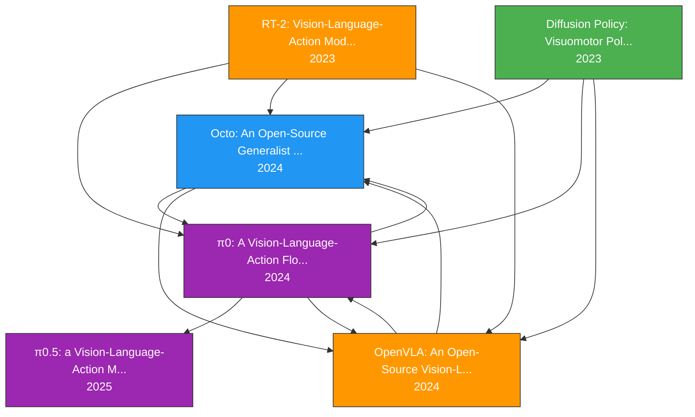

# 论文引用图谱

## 方法线分类

| 论文 | 年份 | 方法线 |
|------|------|--------|
| Diffusion Policy: Visuomotor Policy Learning via A | 2023 | Diffusion Policy |
| RT-2: Vision-Language-Action Models Transfer Web K | 2023 | VLM + Action Token |
| Octo: An Open-Source Generalist Robot Policy (2024 | 2024 | Transformer + Diffusion Head |
| OpenVLA: An Open-Source Vision-Language-Action Mod | 2024 | VLM + Action Token |
| π0: A Vision-Language-Action Flow Model for Genera | 2024 | VLM + Diffusion/Flow Head |
| π0.5: a Vision-Language-Action Model with Open-Wor | 2025 | VLM + Diffusion/Flow Head |

## 时间线

- **2023** Diffusion Policy: Visuomotor Policy Learning via Action Diff
- **2023** RT-2: Vision-Language-Action Models Transfer Web Knowledge t
- **2024** Octo: An Open-Source Generalist Robot Policy (2024) ← 基于 diffusion_policy_2023, rt2_2023, openvla_2024, pi0_2024
- **2024** OpenVLA: An Open-Source Vision-Language-Action Model (2024) ← 基于 pi0_2024, rt2_2023, octo_2024, diffusion_policy_2023
- **2024** π0: A Vision-Language-Action Flow Model for General Robot Co ← 基于 rt2_2023, openvla_2024, octo_2024, diffusion_policy_2023
- **2025** π0.5: a Vision-Language-Action Model with Open-World General ← 基于 pi0_2024