# 人手数据用于机器人 Policy 训练：全景调研

> 基于 EgoScale + Being-H0/H0.5 + JALA + Emergence of H2R 多锚点引用图谱分析，覆盖 40+ 篇核心论文
> 调研时间：2026-03-15（二次更新：多锚点深挖，补充 Phantom/DexCap/LAPA/EgoZero/DexImit 等 13 篇）

## 1. 研究背景与核心问题

机器人灵巧操作（Dexterous Manipulation）面临严重的**数据稀缺**问题：与 NLP 和 CV 领域不同，不存在 Internet 规模的机器人操作数据集。人类每天用手进行大量精细操作，这些数据天然丰富且可被动采集。

**核心问题**：如何将人手操作数据（Human Hand Data）有效迁移到机器人 Policy 训练中？

**关键挑战**：
- **Embodiment Gap（具身差异）**：人手有 20+ DoF，与机器人手/夹爪结构差异巨大
- **视角差异**：第一人称 vs 第三人称，egocentric vs exocentric
- **动作空间差异**：人手关节角度 vs 机器人末端执行器位姿
- **数据对齐**：如何将无标注的人类视频转化为可用的 supervision signal

## 2. 锚点论文：EgoScale

| 属性 | 值 |
|------|------|
| **标题** | EgoScale: Scaling Dexterous Manipulation with Diverse Egocentric Human Data |
| **机构** | NVIDIA + UC Berkeley + HKUST + UMD |
| **时间** | 2026.02 |
| **arXiv** | 2602.16710 |
| **引用数** | 1（新论文） |
| **引用文献** | 47 篇 |

### 核心贡献
- 提出 **两阶段 Human-to-Robot 学习框架**
- **Stage I**：在 **20,854 小时** egocentric 人类视频上预训练 flow-based VLA policy，使用 wrist motion + retargeted 灵巧手动作作为监督信号
- **Stage II**：轻量级 mid-training，用少量对齐的 human-robot 数据进行微调
- 证明 human-to-robot transfer 本质上是一个 **scaling phenomenon**

### 关键发现
- Scaling human data 带来 substantial performance gains
- 出现 **emergent one-shot adaptation** 能力
- **跨具身迁移（cross-embodiment transfer）** 在数据量足够时自然涌现

## 3. 研究流派分类

基于 EgoScale 的 47 篇引用文献和扩展搜索，我们将该领域分为 **五大流派**：

### 流派 A：Egocentric 视频 + 手部追踪 → 直接训练 Policy

> **核心思路**：用第一人称视角视频 + 3D 手部姿态追踪，提取 wrist trajectory 和手指动作，直接作为 policy 训练的 supervision

| 论文 | 年份 | 引用 | 机构 | 核心方法 |
|------|------|------|------|----------|
| **EgoScale** | 2026 | 1 | NVIDIA | 20K 小时 ego 视频 → flow-based VLA，两阶段训练 |
| **Being-H0** | 2025 | — | BeingBeyond | 大规模人类视频预训练 VLA，引入 UniHand 数据集，支持夹爪到灵巧手 |
| **Being-H0.5** | 2026 | 6 | BeingBeyond | 引入 UniHand-2.0（35K+ 小时），Mixture-of-Transformers，跨具身泛化 |
| **JALA** | 2026 | — | — | Joint-Aligned Latent Action，人手视频预训练 VLA，生成逼真手部运动 |
| **EgoMimic** | 2024 | 119 | Georgia Tech | AR 眼镜采集 ego 视频 + 3D 手部追踪，human-robot co-training |
| **EgoDex** | 2025 | 71 | Apple | 大规模 ego 视频数据集 + benchmark，开源 |
| **EgoVLA** | 2025 | 52 | NVIDIA | 人手运动预训练 VLA → IK + retargeting 迁移到机器人 |
| **DexWild** | 2025 | 26 | Stanford | In-the-wild 人手交互数据 → 机器人 policy |
| **EgoBridge** | 2025 | 10 | Georgia Tech | Domain adaptation 解决 ego human → robot 的 domain gap |
| **EgoZero** | 2025 | 26 | UC Berkeley | Smart Glasses 采集 ego 数据 → 机器人学习 |
| **EMMA** | 2025 | 10 | Stanford | Scaling Mobile Manipulation via Egocentric Human Data |
| **EgoHumanoid** | 2026 | 4 | — | Ego 示范 → 人形机器人 loco-manipulation，无需机器人数据 |
| **MAPLE** | 2025 | — | ETH Zurich | Ego 视频学习 contact points + hand pose → 操作先验 |
| **HaWoR** | 2025 | — | CVPR 2025 | 世界坐标系 3D 手部运动重建，为 ego → robot 提供基础追踪能力 |

**关键技术**：
- **手部追踪**：Apple Vision Pro / Meta Quest / AR 眼镜 → 3D hand pose；HaWoR 提供世界坐标系手部运动重建
- **动作提取**：wrist 6-DoF trajectory + finger joint angles；JALA 通过 joint-aligned latent action 编码
- **Co-training**：将人类数据和少量机器人数据混合训练
- **大规模数据集**：Being-H0.5 引入 UniHand-2.0（35K+ 小时），是目前最大规模的人手操作数据

**代表性管线（Being-H0/H0.5）**：
```
大规模 ego 人类视频 → UniHand-2.0 手部追踪标注 →
Mixture-of-Transformers VLA 预训练 →
少量机器人数据 post-training →
跨具身部署（夹爪 / 灵巧手 / 人形机器人）
```

### 流派 B：手部动作重定向（Retargeting）→ 机器人控制

> **核心思路**：将人手动作通过运动学重定向映射到机器人手，解决具身差异

| 论文 | 年份 | 引用 | 机构 | 核心方法 |
|------|------|------|------|----------|
| **DexUMI** | 2025 | 47 | Columbia | 人手作为 universal manipulation interface，硬件+软件适配 |
| **DexCap** | 2024 | 226 | Stanford | 便携式 mocap 系统采集灵巧操作数据，手指级别精度 |
| **ManipTrans** | 2025 | 44 | — | 高效灵巧双手操作迁移，residual learning |
| **DexImit** | 2026 | 0 | — | 从单目人类视频学习双手灵巧操作 |
| **TactAlign** | 2026 | 0 | — | 通过触觉对齐实现 human-to-robot policy transfer |
| **Humanoid Policy ≈ Human Policy** | 2025 | 57 | UT Austin | 人类示范直接用于人形机器人 policy |
| **HOMIE** | 2025 | 104 | 上海 AI Lab | 同构外骨骼遥操作 → 人形机器人灵巧操作 |
| **ViViDex** | 2024 | — | INRIA | 人类视频 → 提取参考轨迹 → state-based policy → vision-based policy |

**关键技术**：
- **运动学重定向**：手指关节 → 机器人手指关节（需解决 DoF 不匹配）
- **接触映射**：人手-物体接触点 → 机器人-物体接触点
- **DexUMI 创新**：用可穿戴设备采集人手操作，直接在真实物体上演示，最小化具身差距

### 流派 C：人类视频预训练 / 表征学习 → 迁移到机器人

> **核心思路**：用大量人类交互视频预训练视觉表征或 VLA 模型，然后迁移到机器人任务

| 论文 | 年份 | 引用 | 机构 | 核心方法 |
|------|------|------|------|----------|
| **Emergence of H2R Transfer** | 2025 | 8 | Physical Intelligence | Co-training recipe，transfer 在 VLA scale up 后涌现 |
| **R3M** | 2022 | 815 | Meta | Ego4D 视频预训练视觉表征 → 机器人操作 |
| **MimicPlay** | 2023 | 290 | NVIDIA | 观看人类 play → 长视野模仿学习 |
| **XSkill** | 2023 | 108 | Columbia | 跨具身技能发现，人类 → 机器人 |
| **Visual Imitation Made Easy** | 2020 | 157 | CMU | 跨域视觉模仿（人 → 机器人） |
| **HOP** | 2024 | — | UC Berkeley | 从视频中提取 3D hand-object 轨迹 → 预训练机器人 |
| **LAPA** | 2024 | 191 | KAIST | Latent Action Pretraining from Videos，从视频学 latent action |
| **Affordances from Human Videos** | 2023 | 275 | CMU | 人类视频 affordance 作为机器人通用表征 |
| **Human-to-Robot Imitation in the Wild** | 2022 | 231 | CMU | 野外人类视频 → 机器人模仿学习 |
| **Phantom** | 2025 | 53 | Stanford | 仅用人类视频训练机器人，完全不需要机器人数据 |
| **Gen2Act** | 2024 | 113 | Google | 人类视频生成 → 泛化机器人操作 |
| **VidBot** | 2025 | 37 | — | 野外 2D 人类视频 → 3D 机器人动作，zero-shot |
| **LBM** | 2025 | — | TRI (Toyota) | 1700 小时遥操作数据训练 Large Behavior Model，灵巧操作 scaling |

**Emergence of Human to Robot Transfer（Physical Intelligence, 2025）** 是该流派的标志性工作：
- 发现 human-to-robot transfer 不需要特殊设计
- 只需要 **简单的 co-training recipe**
- 当 VLA 预训练足够多的 scenes、tasks、embodiments 后，transfer **自然涌现**
- 与 EgoScale 的发现高度吻合：**scaling is all you need**

### 流派 D：World Model + 人类视频 → 机器人操作

> **核心思路**：用人类视频训练 world model，再用 world model 辅助 policy 学习

| 论文 | 年份 | 引用 | 机构 | 核心方法 |
|------|------|------|------|----------|
| **DexWM** | 2025 | — | MIT | 900+ 小时人类+机器人视频训练 latent world model → 灵巧操作 |
| **DreamDojo** | 2026 | 4 | — | 大规模人类视频训练 generalist robot world model |
| **MotionTrans** | 2025 | — | 清华 | 人类 VR 数据 → motion-level 学习 → 机器人操作 policy |
| **FLARE** | 2025 | 37 | NVIDIA | Implicit world modeling → 机器人学习 |

**DexWM 关键发现**：
- 仅预测 visual features 不够，需要额外预测 hand pose features
- 在 Franka + Allegro 上 zero-shot 泛化，比 Diffusion Policy 高 50%+

### 流派 E：跨域迁移接口（Flow / Motion Primitives）

> **核心思路**：用中间表征（光流、运动原语）桥接人手-机器人的具身差异

| 论文 | 年份 | 引用 | 机构 | 核心方法 |
|------|------|------|------|----------|
| **Flow as Cross-Domain Interface** | 2024 | 122 | Columbia | 光流作为跨域操作接口 |
| **Data Scaling Laws in IL** | 2024 | 136 | PKU | 模仿学习中的数据 scaling 规律 |

## 4. 关键数据集

| 数据集 | 来源 | 规模 | 标注 | 用途 |
|--------|------|------|------|------|
| **Ego4D** | Meta | 3,670 小时 | 视频 + 叙述 | 视觉预训练 |
| **EPIC-KITCHENS** | Bristol | 100 小时 | 厨房操作标注 | 操作理解 |
| **EgoDex** (Apple) | 众包 | 大规模 | 3D hand pose | 灵巧操作 benchmark |
| **EgoMimic 数据** | AR 眼镜 | 数百 demo | 3D hand + ego video | co-training |
| **BridgeData V2** | Berkeley | 60K+ 轨迹 | 机器人操作 | 多任务预训练 |
| **Open X-Embodiment** | Google+ | 百万轨迹 | 多机器人 | foundation model |
| **MotionTrans** | VR 设备 | 开源 | 6-DoF motion | motion-level 学习 |
| **UniHand / UniHand-2.0** | Being-H0/H0.5 | 35K+ 小时 | 3D hand pose + wrist trajectory | VLA 预训练（目前最大规模人手数据集） |
| **Uni-Hand** | IRMVLab | 多数据集 | hand motion forecasting | ego 手部运动预测 → robot policy transfer |
| **Nymeria** | Meta | 大规模多模态 | ego 日常运动 | 野外全身运动采集 |
| **DexCap 数据** | Stanford | mocap demos | 手指级精度 | 灵巧操作 mocap |
| **HOI4D** | — | 4D egocentric | 手-物交互分类标注 | 交互理解 |
| **ARCTIC** | ETH | 双手操作 | 双手-物体 mesh | 灵巧双手操作 |

## 5. 技术路线对比

### 5.1 数据源对比

| 数据源 | 规模 | 成本 | 标注质量 | 代表工作 |
|--------|------|------|----------|----------|
| **Ego 视频（被动采集）** | ★★★★★ | ★ | ★★（需手部追踪） | EgoScale, EgoDex, Being-H0/H0.5, R3M |
| **AR/VR 设备采集** | ★★★ | ★★ | ★★★★（自带追踪） | EgoMimic, MotionTrans |
| **遥操作采集** | ★★ | ★★★★ | ★★★★★ | HOMIE, DexUMI |
| **In-the-wild 抓取** | ★★★★ | ★★ | ★★★ | DexWild |

### 5.2 迁移策略对比

| 策略 | 优点 | 缺点 | 代表工作 |
|------|------|------|----------|
| **Co-training** | 简单有效，scaling 友好 | 需少量 robot 数据 | EgoScale, EgoMimic, Being-H0/H0.5, Emergence |
| **Retargeting** | 保留精细动作 | 需 embodiment-specific 映射 | DexUMI, ViViDex |
| **表征预训练** | 通用性强 | 可能丢失动作细节 | R3M, HOP, MAPLE |
| **World Model** | 可 zero-shot | 训练复杂 | DexWM, FLARE |
| **直接 finetune** | 端到端 | 数据需对齐 | EgoVLA, Humanoid Policy |

## 6. 关键洞察与趋势

### 6.1 Scaling 是核心
EgoScale 和 Physical Intelligence 的工作共同验证了一个重要发现：
> **Human-to-robot transfer 不需要精巧的算法设计，本质上是一个 scaling phenomenon。**

当预训练数据量（scenes × tasks × embodiments）足够大时，VLA 模型自动学会跨具身迁移。

### 6.2 Egocentric 视角成为主流
几乎所有 2024-2026 的新工作都采用第一人称视角，原因：
- **视角对齐**：ego 视角更接近机器人 wrist camera
- **被动可扩展**：AR 眼镜 / 手机 → 海量数据
- **手部可见**：ego 视角天然包含手部信息

### 6.3 从 Representation 到 Action
技术路线演进：
```
R3M (2022): 只学 visual representation
     ↓
MimicPlay (2023): 学 latent plan + low-level action
     ↓
EgoMimic (2024): 直接 co-train action policy
     ↓
Being-H0 (2025): 大规模人类视频 VLA 预训练 + UniHand 数据集
     ↓
Being-H0.5 / EgoScale / JALA (2026): 35K+ 小时数据，跨具身泛化，latent action
```

### 6.4 灵巧手操作成为新前沿
2025 年后，研究重心从夹爪操作转向**多指灵巧手**：
- EgoScale、EgoDex、DexUMI、DexWild、MAPLE 都聚焦灵巧手
- 人手数据在灵巧操作中的价值远大于夹爪操作（人手与灵巧手更接近）

## 7. 引用图谱（Mermaid）

```mermaid
graph TD
    subgraph "Egocentric Policy 训练"
        EgoScale["EgoScale<br/>NVIDIA 2026<br/>20K小时 ego VLA"]
        BeingH0["Being-H0<br/>BeingBeyond 2025<br/>UniHand 数据集"]
        BeingH05["Being-H0.5<br/>BeingBeyond 2026<br/>UniHand-2.0 35K小时"]
        JALA["JALA<br/>2026<br/>Joint-Aligned Latent Action"]
        EgoMimic["EgoMimic<br/>Georgia Tech 2024<br/>119 citations"]
        EgoDex["EgoDex<br/>Apple 2025<br/>71 citations"]
        EgoVLA["EgoVLA<br/>NVIDIA 2025<br/>52 citations"]
        DexWild["DexWild<br/>Stanford 2025<br/>26 citations"]
        EgoBridge["EgoBridge<br/>Georgia Tech 2025<br/>10 citations"]
        MAPLE["MAPLE<br/>ETH 2025"]
        HaWoR["HaWoR<br/>CVPR 2025<br/>3D 手部运动重建"]
    end

    subgraph "Retargeting 路线"
        DexUMI["DexUMI<br/>Columbia 2025<br/>47 citations"]
        ViViDex["ViViDex<br/>INRIA 2024"]
        HumanoidPolicy["Humanoid Policy≈Human Policy<br/>UT Austin 2025<br/>57 citations"]
        HOMIE["HOMIE<br/>上海AILab 2025<br/>104 citations"]
    end

    subgraph "预训练/表征学习"
        R3M["R3M<br/>Meta 2022<br/>815 citations"]
        MimicPlay["MimicPlay<br/>NVIDIA 2023<br/>290 citations"]
        XSkill["XSkill<br/>Columbia 2023<br/>108 citations"]
        EmergenceH2R["Emergence of H2R<br/>π 2025<br/>8 citations"]
        HOP["HOP<br/>Berkeley 2024"]
        LBM["LBM<br/>TRI 2025<br/>1700小时遥操作"]
    end

    subgraph "World Model 路线"
        DexWM["DexWM<br/>MIT 2025"]
        MotionTrans["MotionTrans<br/>清华 2025"]
        FLARE["FLARE<br/>NVIDIA 2025<br/>37 citations"]
    end

    subgraph "跨域接口"
        FlowInterface["Flow as Interface<br/>Columbia 2024<br/>122 citations"]
    end

    %% EgoScale 引用关系
    EgoScale -->|引用| EgoMimic
    EgoScale -->|引用| EgoDex
    EgoScale -->|引用| EgoVLA
    EgoScale -->|引用| DexWild
    EgoScale -->|引用| EgoBridge
    EgoScale -->|引用| DexUMI
    EgoScale -->|引用| HumanoidPolicy
    EgoScale -->|引用| HOMIE
    EgoScale -->|引用| EmergenceH2R
    EgoScale -->|引用| MimicPlay
    EgoScale -->|引用| XSkill
    EgoScale -->|引用| FlowInterface
    EgoScale -->|引用| FLARE
    EgoScale -->|引用| R3M

    %% Being-H 系列关系
    BeingH05 -->|演进| BeingH0
    BeingH05 -->|使用| HaWoR
    BeingH0 -->|引用| EgoMimic
    JALA -->|引用| BeingH0

    %% 其他引用关系
    EgoBridge -->|引用| EgoMimic
    DexWM -->|引用| EgoDex
    DexWM -->|引用| MAPLE
    MotionTrans -->|引用| DexUMI
    MotionTrans -->|引用| EgoVLA
    EgoDex -->|引用| EgoMimic
    MAPLE -->|引用| EgoMimic
    EmergenceH2R -->|引用| R3M

    style EgoScale fill:#ff6b6b,stroke:#333,color:#fff
    style BeingH05 fill:#ff6b6b,stroke:#333,color:#fff
    style JALA fill:#ff6b6b,stroke:#333,color:#fff
    style EmergenceH2R fill:#4ecdc4,stroke:#333,color:#fff
    style R3M fill:#45b7d1,stroke:#333,color:#fff
    style EgoMimic fill:#f9ca24,stroke:#333
    style HaWoR fill:#a29bfe,stroke:#333,color:#fff
    style LBM fill:#fd79a8,stroke:#333,color:#fff
```



## 8. 推荐阅读顺序

1. **入门**：R3M (2022) → Visual Imitation Made Easy (2020) — 理解基础问题
2. **核心**：EgoMimic (2024) → Being-H0 (2025) → Being-H0.5 / EgoScale (2026) — 理解 ego VLA 预训练范式
3. **数据**：EgoDex (2025) → UniHand-2.0 (Being-H0.5) → DexWild (2025) — 理解数据采集和规模
4. **动作编码**：JALA (2026) — 理解 joint-aligned latent action 编码
5. **基础工具**：HaWoR (2025) — 理解 3D 手部运动重建
6. **Retargeting**：DexUMI (2025) → ViViDex (2024) — 理解具身迁移
7. **Scaling 洞察**：Emergence of H2R Transfer (2025) + LBM (2025) — 理解 scaling law
8. **前沿**：DexWM (2025) → MotionTrans (2025) — World Model 路线

## 9. 开放问题

1. **数据质量 vs 数量**：EgoScale 用 20K 小时粗标注数据，DexUMI 用少量精细数据，哪个更高效？
2. **泛化边界**：human-to-robot transfer 能泛化到多不同的机器人形态？
3. **灵巧操作的上限**：当前方法能否达到人类级别的灵巧操作？
4. **实时性**：预训练大模型的推理延迟能否满足灵巧操作的实时需求？
5. **安全性**：从人类数据学到的 policy 是否会继承人类的不安全操作习惯？

---

*本报告基于 EgoScale + Being-H0/H0.5 + JALA + Emergence of H2R 多锚点引用图谱分析生成，覆盖 40+ 篇核心论文*

## 附录：论文速查表

| 简称 | 全称 | arXiv | 年份 | 与人手数据的关系 |
|------|------|-------|------|-----------------|
| **EgoScale** | Scaling Dexterous Manipulation with Diverse Egocentric Human Data | 2602.16710 | 2026 | 锚点，20K 小时 ego 视频 VLA |
| **Being-H0** | Vision-Language-Action Pretraining from Large-Scale Human Videos | 2507.15597 | 2025 | 人类视频 VLA 预训练 + UniHand |
| **Being-H0.5** | Scaling Human-Centric Robot Learning for Cross-Embodiment Generalization | 2601.12993 | 2026 | UniHand-2.0（35K+ 小时）+ MoT 架构 |
| **JALA** | Joint-Aligned Latent Action: Towards Scalable VLA Pretraining in the Wild | 2602.21736 | 2026 | Joint-aligned latent action 编码人手运动 |
| **HaWoR** | World-Space Hand Motion Reconstruction from Egocentric Videos | 2501.02973 | 2025 | 世界坐标系 3D 手部运动重建（CVPR 2025） |
| **UniHand 2.0** | （Being-H0.5 的数据集组件） | — | 2026 | 35K+ 小时人手操作数据，目前最大 |
| **Uni-Hand** | Universal Hand Motion Forecasting in Egocentric Views | 2511.12878 | 2025 | ego 手部运动预测 + robot policy transfer |
| **LBM** | A Careful Examination of Large Behavior Models for Multitask Dexterous Manipulation | 2507.05331 | 2025 | 1700 小时遥操作灵巧操作 scaling（TRI） |
| **Phantom** | Training Robots Without Robots Using Only Human Videos | 2503.00779 | 2025 | 仅人类视频训练机器人（Stanford） |
| **DexCap** | Scalable and Portable Mocap Data Collection System for Dexterous Manipulation | 2403.07788 | 2024 | 便携式 mocap 采集灵巧操作数据 |
| **LAPA** | Latent Action Pretraining from Videos | 2410.11758 | 2024 | 从视频学 latent action（KAIST） |
| **EgoZero** | Robot Learning from Smart Glasses | 2505.20290 | 2025 | Smart Glasses ego 数据 → 机器人 |
| **EMMA** | Scaling Mobile Manipulation via Egocentric Human Data | 2509.04443 | 2025 | Ego 人类数据 → 移动操作 |
| **EgoHumanoid** | Unlocking In-the-Wild Loco-Manipulation with Robot-Free Egocentric Demonstrations | 2602.10106 | 2026 | Ego 示范 → 人形机器人 |
| **DexImit** | Learning Bimanual Dexterous Manipulation from Monocular Human Videos | 2602.10105 | 2026 | 单目人类视频 → 双手灵巧操作 |
| **TactAlign** | Human-to-Robot Policy Transfer via Tactile Alignment | 2602.13579 | 2026 | 触觉对齐的 human-to-robot transfer |
| **DreamDojo** | A Generalist Robot World Model from Large-Scale Human Videos | 2602.06949 | 2026 | 人类视频 → 通用 robot world model |
| **ManipTrans** | Efficient Dexterous Bimanual Manipulation Transfer via Residual Learning | 2503.21860 | 2025 | 灵巧双手操作迁移 |
| **Gen2Act** | Human Video Generation in Novel Scenarios enables Generalizable Robot Manipulation | 2409.16283 | 2024 | 人类视频生成 → 机器人泛化 |
| **VidBot** | Learning Generalizable 3D Actions from In-the-Wild 2D Human Videos | 2503.07135 | 2025 | 野外 2D 人类视频 → 3D 机器人动作 |
| **Affordances from Human Videos** | Affordances from Human Videos as a Versatile Representation for Robotics | 2304.08488 | 2023 | 人类视频 affordance → 机器人表征 |
| **Human-to-Robot Imitation in the Wild** | Human-to-Robot Imitation in the Wild | 2207.09450 | 2022 | 野外 H2R 模仿学习（经典） |
| **EgoMimic** | Scaling Imitation Learning via Egocentric Video | 2410.24221 | 2024 | AR 眼镜 ego + co-training |
| **EgoDex** | Learning Dexterous Manipulation from Large-Scale Egocentric Video | 2505.11709 | 2025 | Apple 开源 ego 灵巧操作数据集 |
| **EgoVLA** | Learning VLA Models from Egocentric Human Videos | 2507.12440 | 2025 | 人手运动 VLA → retargeting |
| **DexWild** | Dexterous Human Interactions for In-the-Wild Robot Policies | 2505.07813 | 2025 | 野外人手数据 → robot policy |
| **DexUMI** | Using Human Hand as the Universal Manipulation Interface | 2505.21864 | 2025 | 人手作为通用操作接口 |
| **DexWM** | World Models Can Leverage Human Videos for Dexterous Manipulation | 2512.13644 | 2025 | World model + 人类视频 |
| **Emergence of H2R** | Emergence of Human to Robot Transfer in VLA Models | 2512.22414 | 2025 | 迁移在 scaling 后涌现（π） |
| **R3M** | A Universal Visual Representation for Robot Manipulation | 2203.12601 | 2022 | Ego4D 预训练视觉表征（经典） |
